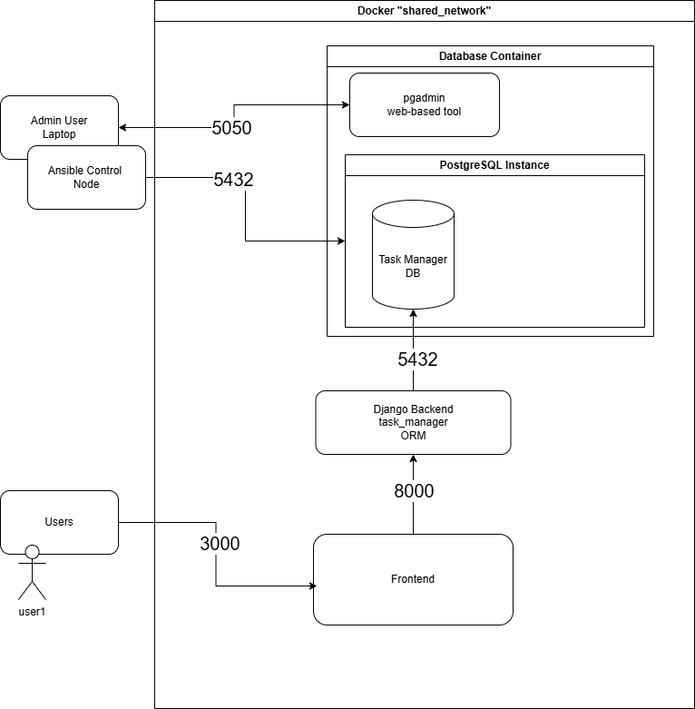

# Basic Project for Postgres ORM

## Diagram

## Notes
* See docs/ for more information on setup and screenshots
* Built mainly with docker
* This is a base project and can be greatly improved
    * Setup HA + replication for postgres
    * Setup more complex ORMs
    * Improve front end capabilities
    * Monitoring strategy

## Description:
1. PostgreSQL Instance  
2. pgadmin4 for Admin work and management
3. Ansible to deploy pg databases
4. Python Django ORM + API for backend
5. Python Django for front end

## Installation:
* follow docs/README.md

## Usage:
* basic create and delete task management application
